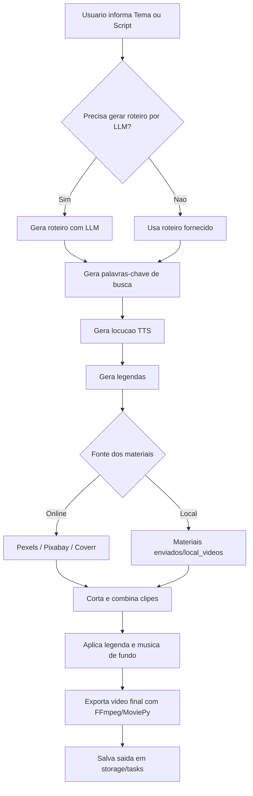

# Documentacao do Projeto - MoneyPrinterTurbo

Este documento descreve a arquitetura, o fluxo de execucao, os pontos de configuracao e o processo de deploy do fork/custom deployment do **MoneyPrinterTurbo**.

---

## 1. Visao Geral

O **MoneyPrinterTurbo** e uma ferramenta automatizada para gerar videos curtos para TikTok, YouTube Shorts, Reels e plataformas similares a partir de prompts de texto, roteiros, locucao, legendas, musica de fundo e materiais de video/imagem locais ou online.

Principais fontes de materiais online suportadas:

- `Pexels`
- `Pixabay`
- `Coverr`

O projeto tambem permite uso de materiais locais enviados pelo usuario.

---

## 2. Arquitetura e Entrypoints

O projeto possui tres formas principais de execucao.

### A. Interface Grafica (WebUI)

- Arquivo de entrada: `webui/Main.py`
- Tecnologia: Streamlit
- Porta padrao: `8501`
- Scripts locais:
  - Windows: `webui.bat`
  - macOS/Linux: `webui.sh` ou `uv run streamlit run ./webui/Main.py --browser.gatherUsageStats=False`
- Funcao: permite configurar tema, roteiro, provedores LLM, vozes TTS, legendas, fontes, materiais, musica de fundo e parametros de renderizacao.

### B. API FastAPI

- Arquivo de entrada: `main.py`
- Aplicacao ASGI: `app.asgi:app`
- Porta padrao: `8080`
- Prefixo das rotas v1: `/api/v1`
- Documentacao de rotas:
  - `/docs`
  - `/openapi.json`
- Rotas registradas em producao: `app/router.py`
- Observacao: `app/controllers/ping.py` existe, mas nao e incluido no router; portanto `/ping` retornar `404` e esperado.

### C. CLI

- Arquivo de entrada: `cli.py`
- Exemplo:

```shell
uv run python cli.py --video-subject "A importancia da disciplina"
```

- A CLI usa o mesmo pipeline de servicos da WebUI/API e pode parar em etapas intermediarias com `--stop-at`.

---

## 3. Estrutura de Diretorios

- `app/`: backend e servicos principais.
- `app/config/`: carregamento de `config.toml` e valores padrao.
- `app/controllers/`: endpoints FastAPI.
- `app/controllers/v1/`: rotas versionadas em `/api/v1`.
- `app/models/`: schemas Pydantic, enums e constantes.
- `app/services/`: servicos de LLM, voz, video, legendas, estado, materiais e upload/cross-post.
- `app/utils/`: utilitarios gerais e protecoes de path.
- `webui/`: interface Streamlit e arquivos i18n.
- `resource/`: fontes, musicas e assets estaticos.
- `storage/`: cache, tarefas, arquivos temporarios e estado local.
- `test/`: testes unitarios com `unittest`.
- `docs/`: imagens, lista de vozes e notebook Colab.

---

## 4. Fluxo de Geracao de Video



---

## 5. Prompt de Roteiro e CTA Obrigatorio

A geracao de roteiro fica em `app/services/llm.py`.

Pontos principais:

- `DEFAULT_SCRIPT_SYSTEM_PROMPT`: prompt padrao para geracao de roteiro.
- `MANDATORY_SCRIPT_CTA_PROMPT`: orientacao fixa de chamada para acao.
- `build_script_prompt()`: monta o prompt final enviado ao LLM.
- `generate_script()`: executa a chamada ao provedor LLM e normaliza o resultado.

O bloco `MANDATORY_SCRIPT_CTA_PROMPT` exige que todo roteiro gerado inclua, de forma natural e no idioma do roteiro, uma chamada para a pessoa se inscrever no canal, deixar like, curtir o video, compartilhar com outra pessoa e seguir o perfil/canal quando fizer sentido para a plataforma.

Essa regra e anexada dentro de `build_script_prompt()` depois da escolha entre `custom_system_prompt` e `DEFAULT_SCRIPT_SYSTEM_PROMPT`. Assim, a orientacao continua valendo mesmo quando um usuario avancado substitui o prompt do sistema pela WebUI ou API.

---

## 6. Configuracao e Secrets

- Arquivo de exemplo: `config.example.toml`
- Arquivo local real: `config.toml`
- `config.toml` e ignorado pelo Git e tambem excluido do contexto Docker por `.dockerignore`.
- Em containers/Coolify, se `config.toml` nao existir, o app copia `config.example.toml` para `config.toml` no runtime.
- Chaves de API devem ser configuradas de forma segura via arquivo persistente, volume, painel do Coolify ou estrategia operacional equivalente.

Observacao operacional: se o provider estiver como `openai` e `openai_api_key` nao estiver configurada, a geracao de roteiro falhara com erro de API key ausente.

---

## 7. Execucao Local

### Pre-requisitos

- Python `>=3.11,<3.13`
- `uv` recomendado

### Instalar dependencias

```shell
uv sync --frozen
```

### Rodar WebUI

```cmd
.\webui.bat
```

### Rodar API

```shell
uv run python main.py
```

### Rodar testes

```shell
python -m unittest discover -s test
```

Teste especifico de LLM:

```shell
uv run python -m unittest test.services.test_llm
```

---

## 8. Deploy Coolify

Este fork usa Coolify em modo Docker Compose para publicar WebUI e API ao mesmo tempo.

Recurso Coolify atual:

- Nome: `money-printer-turbo:completo`
- UUID: `pn25p4iuncprsq6g5bnj3m84`
- Branch: `main`
- Build pack: `dockercompose`

Dominios atuais:

- WebUI: `https://moneyprinterturbo.genialsolucoesdigitais.com.br/`
- API: `https://api-moneyprinterturbo.genialsolucoesdigitais.com.br/`

Notas importantes:

- O deployment funcional depende das labels Traefik explicitas em `docker-compose.yml`.
- Nao remover `traefik.docker.network=coolify` nem a rede externa `coolify` sem retestar.
- O Dockerfile isolado inicia apenas a WebUI; para WebUI + API use Docker Compose.
- O status Coolify pode aparecer como `running:unknown` porque health checks estao desabilitados; valide por HTTP.

Smoke checks pos-deploy:

```shell
curl -I https://moneyprinterturbo.genialsolucoesdigitais.com.br/
curl -I https://api-moneyprinterturbo.genialsolucoesdigitais.com.br/docs
curl -I https://api-moneyprinterturbo.genialsolucoesdigitais.com.br/openapi.json
curl -I https://api-moneyprinterturbo.genialsolucoesdigitais.com.br/ping
```

Resultados esperados:

- WebUI `/`: `HTTP 200`
- API `/docs`: `HTTP 200`
- API `/openapi.json`: `HTTP 200`
- API `/ping`: `HTTP 404`

---

## 9. Seguranca

- A API possui funcao `verify_token()` em `app/controllers/base.py`, mas as rotas v1 atuais usam `new_router()` sem dependencia de autenticacao.
- Portanto, por padrao, os endpoints publicos da API nao exigem `x-api-key`.
- CORS permite `*` se `CORS_ALLOWED_ORIGINS` nao for configurado.
- Uploads e downloads usam sanitizacao e validacao de path para reduzir risco de path traversal.
- `tls_verify` fica ligado por padrao para chamadas externas de materiais.

---

## 10. Sincronizacao com o Repositorio Upstream

- Repositorio Original: `https://github.com/harry0703/MoneyPrinterTurbo`
- Repositorio Fork: `https://github.com/felipebarbosavasconcelos13-coder/MoneyPrinterTurbo`
- As customizacoes exclusivas do nosso fork estao concentradas em:
  1. `app/models/schema.py`: suporte a ate 25 paragrafos (`le=25`).
  2. `app/services/llm.py`: suporte a ate 25 paragrafos e bloco fixo `MANDATORY_SCRIPT_CTA_PROMPT`.
  3. `docker-compose.yml`: servicos `webui` e `api` conectados a rede `coolify` com labels Traefik para dominios de producao.
  4. `test/services/test_llm.py`: testes unitarios para CTA e paragrafos.
- Ao atualizar para novas versoes do upstream, recomenda-se criar uma branch de trabalho a partir do commit alvo do upstream, reaplicar cirurgicamente essas customizacoes, validar a suite de testes e proceder com deploy controlado no Coolify antes de integrar ao `main`.

